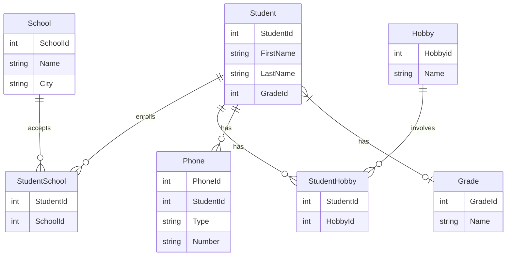

# db2022-inl
Assignment for course in Database development

## Entity Relationship Diagram

## Cardinality

## Clone repository
cd ~
mkdir ws
git clone https://github.com/samkseg/db2022-inl
cd db2022-inl

## Instructions for ORM application
1. Run MYSQL in Docker container
2. GRANT ALL PRIVILEGES ON \*.\* to 'iths'@'%';
3. docker exec -i iths-mysql mysql -uiths -piths < db_auto.sql
4. gradle run

## Instructions for normalizing script
1. Run MYSQL in Docker container
2. GRANT ALL PRIVILEGES ON \*.\* to 'iths'@'%';
3. docker cp denormalized-data.csv container-with-mysql:/var/lib/mysql-files
4. docker exec -i iths-mysql mysql -uiths -piths < normalisering.sql
