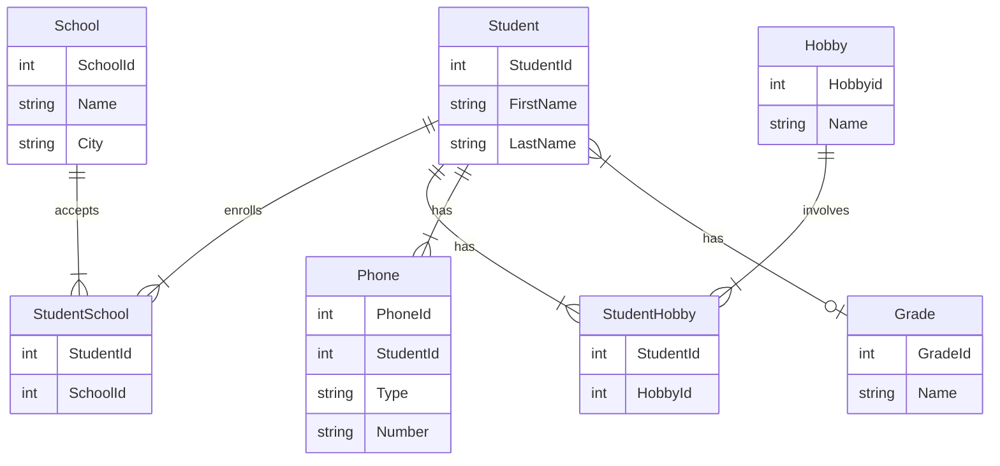

# db2022-inl
Inlämningsuppgift

## Entity Relationship Diagram

```mermaid
erDiagram
    Student ||--|{ StudentSchool : enrolls
    School ||--|{ StudentSchool : accepts
    Student ||--|{ StudentHobby : has
    Hobby ||--|{ StudentHobby : involves
    Student ||--|{ Phone : has
    Student }|--o| Grade : has
       

    Hobby {
    	int Hobbyid
	string Name
    }

    Phone {
    	int PhoneId
	int StudentId
	string Type
	string Number
    }

    StudentHobby {
	  int StudentId
	  int HobbyId 
    }

    StudentSchool {
        int StudentId
        int SchoolId
    }

    Student {
        int StudentId
        string FirstName
        string LastName
    }

    School {
        int SchoolId
        string Name
        string City
    }

    Grade {
        int GradeId
        string Name
    }
```

## Cardinality

